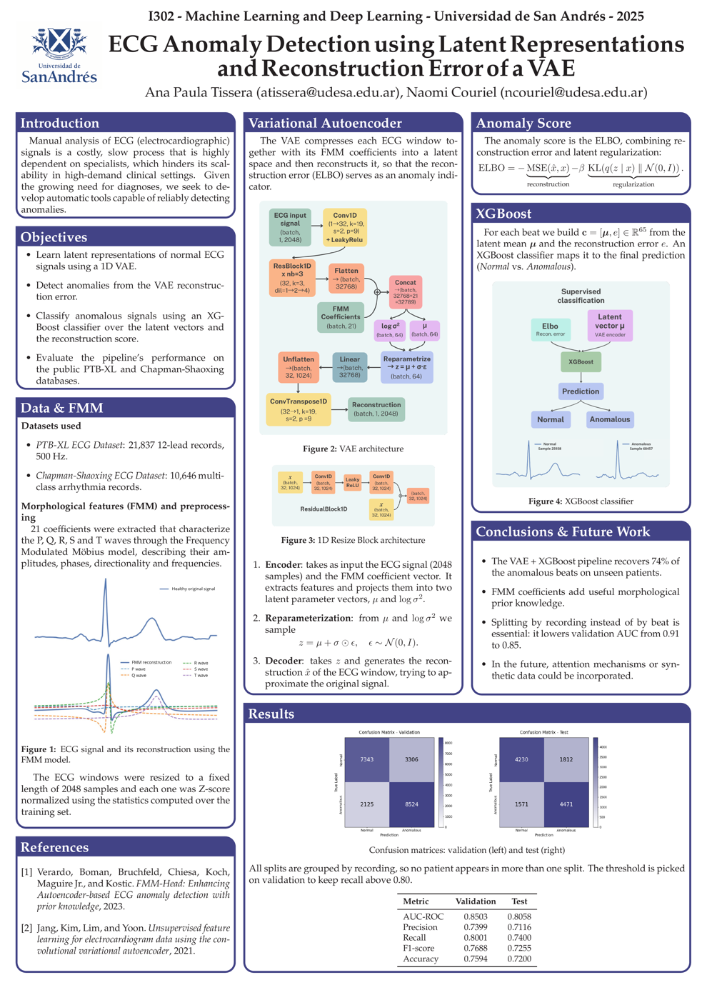

# ECG Anomaly Detection with a 1D VAE and XGBoost

Final project for I302 (Machine Learning and Deep Learning), Universidad de San Andres, 2025.
Ana Paula Tissera, Naomi Couriel.

A 1D Variational Autoencoder is trained only on normal heartbeats. Its latent mean and its
reconstruction error are then fed to an XGBoost classifier that labels each beat as Normal or
Anomalous. Each beat is also described by 21 FMM (Frequency Modulated Mobius) morphological
coefficients, which are given to the encoder as a conditional input.



Full write-up: [report (PDF)](docs/Informe_EN/main.pdf) and [poster (PDF)](docs/poster_EN/poster.pdf).

## Results

| Metric | Validation | Test (held out) |
|---|---|---|
| AUC-ROC | 0.8503 | 0.8058 |
| Precision | 0.7399 | 0.7116 |
| Recall | 0.8001 | 0.7400 |
| F1-score | 0.7688 | 0.7255 |
| Accuracy | 0.7594 | 0.7200 |

Every split is grouped by recording, so all the beats of a patient stay on the same side and no
score is inflated by memorising a patient seen during training. The decision threshold is chosen
on validation as the highest cut that still reaches a recall of 0.80, because for a screening tool
a missed anomaly costs more than a false alarm; on test that operating point recovers 74% of the
anomalous beats at a precision of 0.71.

## Layout

```
src/                       library: dataset loaders, preprocessing, FMM utilities, VAE, plotting
scripts/                   01_build_dataset -> 02_train -> 03_evaluate -> 04_make_figures
saved_models_and_params/   trained VAE, XGBoost classifier, threshold and best hyperparameters
artifacts/                 small outputs that make every figure reproducible without the raw data:
                           losses.json, scores_*.npz, metrics.json, figures/
notebooks/                 exploration and the full narrative pipeline
docs/                      report and poster, in Spanish (original) and English
data/                      raw and processed datasets (large, tracked with Git LFS)
```

`artifacts/` is the important part: `losses.json` and `scores_*.npz` hold the per-epoch losses and
the prediction scores, so `scripts/04_make_figures.py` redraws every figure in seconds without
touching the multi-GB dataset.

## Data

The raw datasets are **not** committed to the repository (they are several GB). They are
downloaded on demand from Google Drive by the loaders. `data/data_processed/data_processed.npz`
(the processed arrays) and the trained models under `saved_models_and_params/` are tracked, so
you can evaluate and redraw figures without downloading anything.

To get the raw datasets:

```bash
python scripts/00_download_data.py   # fetches the FMM datasets into data/ (~3.5 GB)
```

Sources: **PTB-XL v1.0.3** (Wagner et al., 2020, https://doi.org/10.13026/kfzx-aw45),
**Chapman-Shaoxing 12-lead ECG** (Zheng et al., 2020), and their **FMM-preprocessed** versions
from the FMM-Head work (Verardo et al., 2023).

## Reproducing

```bash
pip install -r requirements.txt

python scripts/00_download_data.py   # download raw FMM datasets (only needed to rebuild data)
python scripts/01_build_dataset.py   # build data_processed.npz from the raw datasets
python scripts/02_train.py           # train the VAE, fit XGBoost, pick the threshold
python scripts/03_evaluate.py        # evaluate and write artifacts/
python scripts/04_make_figures.py    # redraw figures from artifacts/ alone (no dataset needed)
```

Training needs a GPU to be practical. On an NVIDIA L4 an epoch takes about 6 seconds, so the
35-epoch run finishes in a few minutes.
